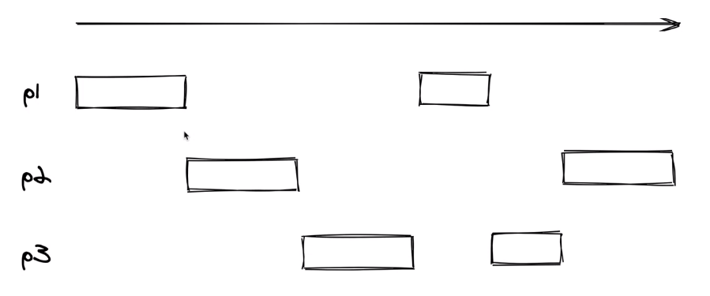

# Section 6. Generator

## generator란?
es5 문법에서 제공되는 함수의 실행을 중간에 멈추고 재개할 수 있는 독특한 기능이다.

## 특징
1. 실행 중간에 원할 때마다 값을 전달할 수 있다.
2. 배열과 달리 값을 미리 만들어 두지 않아 메모리를 효율적으로 사용가능하다.
3. 실제 next 함수가 호출되기 전까지 함수 내부 로직들이 실행되지 않는다(lazy evaluation).

## generator 함수정의
```javascript
    // generator 함수는 *가 function keyword 옆에 붙는다.
    function* f1() {
        console.log("f1-1");
        yield 10; // yield keyword를 사용하여 함수 실행을 중단시킬수 있다.
        console.log("f1-2");
        yield 20;
        console.log("f1-3");
        return "finished";
    }

    // 2. generator 함수를 호출할 경우 반환값으로 generator 객체가 반환된다.
    const gen = f1();
```

## generator 객체
generator 함수를 통해 생성된 generator 객체는 아래와 같은 메서드들을 갖는다.

### 1. next
```javascript
console.log(gen.next()); // 첫 번째 yield 키워드까지 실행된다.
console.log(gen.next()); // 두 번째 yield 키워드까지 실행된다.
console.log(gen.next()); // 다음 yield 키워드가 없을 경우 종료된다.
```
next 메서드를 실행할 경우 아래와 같은 object를 반환 받는다.
```javascript
// 첫 번째 next 함수 호출 결과
f1-1
{
    value: 10,  // yield 키워드로 전달된 값이 설정된다.
    done: false // generator 함수의 진행상태를 나타낸다. 끝날 경우 true로 반환된다.
}
```
generator 객체는 이 next 메서드를 가지기 때문에 iterator라고 할 수 있다.

### 2. return
return 메서드를 호출하게 될 경우 done 프로퍼티가 true가 되고, return 메서드의 파라미터로 전달된 값이 value로 설정된 후 generator를 종료하게 된다.
```javascript
console.log(gen.next());
console.log(gen.return('abc'));
console.log(gen.next());
```
return 메서드 실행결과
```javascript
f1-1
{ value: 10, done: false }
{ value: 'abc', done: true }     // return 메서드를 호출하였기 때문에 바로 종료되어 버린다.
{ value: undefined, done: true } // return 메서드 호출 뒤 next 메서드는 아무런 값도 반환하지 않게 된다.
```

### 3. throw
throw 메서드를 호출할 경우 예외가 발생된 것으로 인식된다.
```javascript
function* f1() {
    // 이런식으로 try catch 문을 사용하여 예외처리를 한다.
    try {
        console.log("f1-1");
        yield 10;
        console.log("f1-2");
        yield 20;
    } catch (e) {
        console.log("f1-catch", e);
        yield 30;
        console.log("f1-3");
        yield 40;
        console.log("f1-4");
    }
}

const gen = f1();
console.log(gen.next());
console.log(gen.throw('some error'));
console.log(gen.next());
console.log(gen.next());
```
throw 메서드 실행결과
```javascript
f1-1
{ value: 10, done: false }
f1-catch some error
{ value: 30, done: false }
f1-3
{ value: 40, done: false }
f1-4
{ value: undefined, done: true }
```

## iterator와 iterable
generator 객체는 iterable이며 iterator다.

### iterator 조건
- next method를 갖고 있다.
- next method는 value와 done 속성값을 가진 객체를 반환한다.
- done 속성값은 작업이 끝났을 때 참이 된다.

### iterable 조건
- Symbol.iterator 속성값으로 함수를 갖고 있다.
- 해당 함수를 호출하면 iterator를 반환한다.

```javascript
const gen = f1();
const iter = gen[Symbol.iterator]();
console.log(">> iter: ", iter);
console.log(">> next: ", gen.next());

// 배열은 iterable이다.
const arr = [10, 20, 30];
const iter2 = arr[Symbol.iterator]();
console.log(iter2.next());
```
위와 같이 실행하면 iter변수가 존재하고 next 함수를 통해 generator의 첫 번째 값이 반환되는 것을 확인 할 수 있다.

따라서 generator 객체는 iterator이자 iterable이라 할 수 있다.

generator는 iterable이기 때문에 다음과 같은 문법에서 유용하게 사용할 수 있다.

### for of 문
```javascript
function* f1() {
    yield 10;
    yield 20;
    yield 30;
}

// done 값이 true가 될 때까지 반복한다.
for (const v of f1()) {
    console.log(v);
}
```

### 전개 연산자(spread operator)
```javascript
// 마찬가지이다.
const arr = [...f1()];
console.log(arr);
```

## generator를 사용하여 함수형 프로그래밍 함수들 구현하기
iterator, iterable, generator를 사용하여 함수형 프로그래밍에 쓰이는 함수들을 구현할 수도 있다. 

아래 세 함수들은 generator 객체 덕분에 새로운 배열 객체를 생성하지 않아 메모리를 좀 더 효율적으로 사용할 수 있다. 

- **일반적인 array의 map, filter, take 함수들은 새 배열 객체를 반환한다**
```javascript
const arr = [1,2,3,4];
const mapped = arr.map(v => v + 1);
console.log("mapped is arr? ", arr === mapped); // 결과 값은 false이다.
```

```javascript
// 함수형 프로그래밍에 자주 등장하는 map, filter, take 함수 구현
function* map(iter, mapper) {
    for (const v of iter) {
        yield mapper(v);
    }
}

function* filter(iter, test) {
    for (const v of iter) {
        if (test(v)) {
            yield v;
        }
    }
}

function* take(n, iter) {
    for (const v of iter) {
        yield v;
        if (--n <= 0) return;
    }
}

const values = [1, 2, 3, 4, 5, 6, 7, 8, 9, 10];
const result = take(
    3,
    map(
        filter(values, n => n % 2 === 0),
        n => n * 10
    )
);
```
위 로직들만 실행시킬 경우 어떻게 될까? 실제 generator 함수는 동작하지 않게된다. 

이렇게 값이 필요한 순간에만 실행되는 것을 지연평가(lazy evaluation)라고 한다.

```javascript
console.log([...result]);
```
이런식으로 전개 연산자를 통해 사용되어야 generator 로직이 실행된다.

generator는 필요한 순간에만 로직이 실행되기 때문에 일반 array를 썼을 때보다 성능이 향상 될 수 있다.

실제 filter 함수에 console.log를 찍어보면 결과 값을 가져오기 위해 실행될 횟수만 로그가 찍히는 것을 확인할 수 있다.

- **일반 배열이 O[n] 만큼 실행된다면, generator를 활용할 경우 O[1~n] 까지 줄일 수 있게 된다.**

## generator를 사용하여 값을 무한대로 표현하기
필요할 때만 값을 생성하는 generator의 특성 때문에 무한대로 값을 표현하는 것이 가능하다.
```javascript
function* naturalNumbers() {
    let v = 1;
    // while 문의 조건값이 true이기 때문에 무한정 loop를 돌게 된다.
    while (true) {
        yield v++;
    }
}

const values = naturalNumbers();
const result = take(
    3,
    map(
        filter(values, n => n % 2 === 0),
        n => n * 10
    )
);
console.log([...result]);
```
위 로직을 사용하더라도 필요한 만큼만 값을 가져오기 때문에 정상적으로 로직이 실행되는 것을 확인할 수 있다.

## generator 함수에서 다른 generator 함수 호출하기
generator 함수 내부에서 다른 generator 함수를 호출할 수도 있다.
```javascript
function* g1() {
    yield 2;
    yield 3;
}
function* g2() {
    yield 1;
    yield* g1();
    // yield* 옆은 iterable이면 무엇이든 올 수 있다.
    // yield* [2, 3];
    yield 4;
}
console.log(...g2());
```

## 외부로부터 데이터 받아오기
generator의 yield 키워드를 통해 외부에서 값을 받아올 수도 있다.
```javascript
function* f1() {
    const data1 = yield;
    console.log(data1);
    const data2 = yield;
    console.log(data2);
}
const gen = f1();
gen.next();
gen.next(10);
gen.next(20);
```
주의해야할게 yield 키워드로 값을 받을 경우 yield 키워드 전 라인까지 실행되기 때문에 첫 번째 next 함수를 호출하면 아무 동작도 하지 않게 된다.

## generator를 사용하여 협업 멀티태스킹(cooperative multitasking)하기
여러 개의 태스크를 실행할 때 하나의 태스크가 종료되기 전에 멈추고 다른 태스크가 실행되는 것을 멀티태스킹이라고 한다.

generator는 실행을 멈추고 재개할 수 있기 대문에 멀티태스킹이 가능하다.

협업이라는 단어가 붙는 이유는 generator가 멈추는 시점을 자발적으로 선택하기 때문이다.(yield keyword를 사용)

반대로 실행을 멈추는 시점을 자발적으로 선택하지 못하면 선점형(preemptive) 멀티태스킹이라고 부른다.

일반적으로 OS는 선점형 멀티태스킹을 사용한다.



```javascript
function* minsu() {
    const myMsgList = [
        '안녕 나는 민수야',
        '만나서 반가워',
        '내일 영화 볼래?',
        '시간 안 되니?',
        '내일모레는 어때?'
    ];
    for (const msg of myMsgList) {
        console.log('수지:', yield msg);
    }
}

function suji() {
    const myMsgList = ['', '안녕 나는 수지야', '그래 반가워', '...'];
    const gen = minsu();
    for (const msg of myMsgList) {
        console.log('민수:', gen.next(msg).value);
    }
}

suji();
```
위와 같은 형태로 일반함수와 generator 함수간에 협엽태스킹이 가능하다.

## generator 함수에서 발생한 예외처리하기
generator 함수에서 발생한 예외일 경우 아래와 같이 처리할 수 있다.
```javascript
function* genFunc() {
    // 이런식으로 generator 함수에서 예외를 발생시키면,
    throw new Error("some error");
}

function func() {
    const gen = genFunc();
    try {
        // next 함수를 호출하는 쪽에 영항을 끼친다.
        gen.next();
    } catch (e) {
        console.log('in catch');
    }
}

func();

```